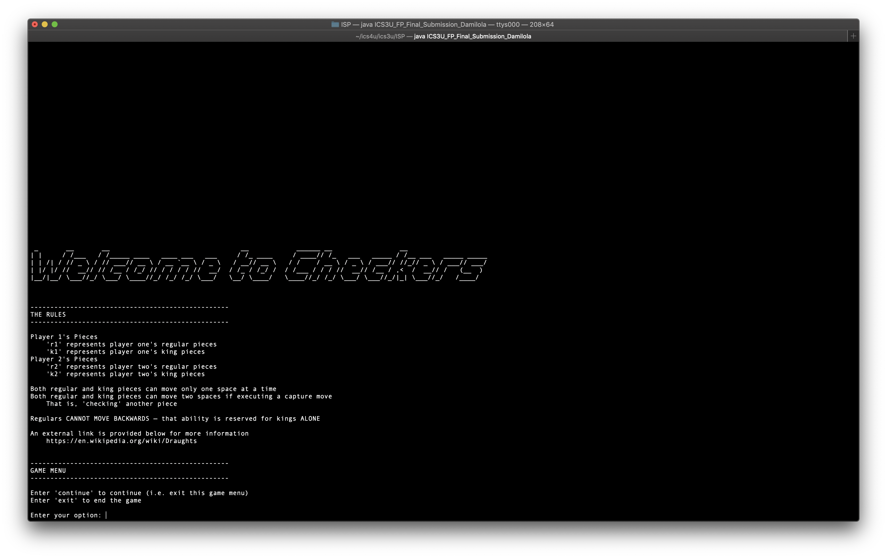
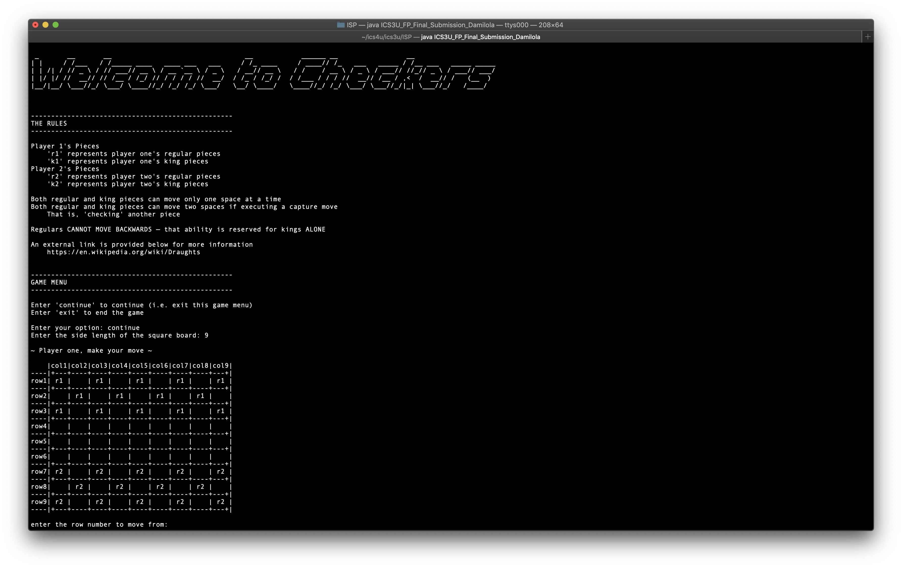

# ICS3U ISP
An ASCII game of checkers (with the full standard rules). Working alone, I brought this entire project to completion. It was my own idea for an Independent Study Project (ISP) for an ICS 3U course.

`ICS3U_FP_Final_Submission_Damilola.java` is the file I submitted to my instructor for evaluation (all other files are merely partially working proof of concepts). It contains an implementation of checkers.

# Fancy Screenshots

Note that a sample of the game's output can be found in `DEMO.txt` or any file of the form `TST session output - *.txt`.

